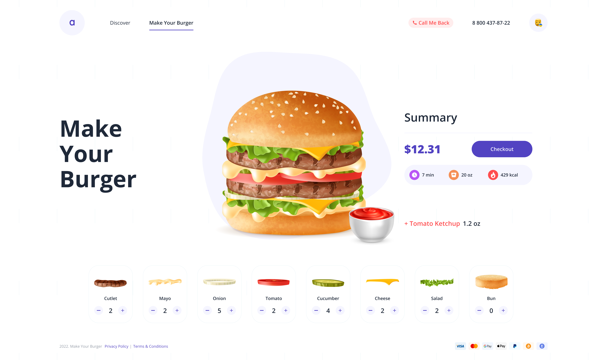

# MYB
<br/>

[Demo do projeto](https://exquisite-crumble-6c4542.netlify.app)


# Sobre

Esse projeto decidir fazer utilizado Vue pois nunca tinha usado e queria aprender fiz muitas gambiarras mas consigo aprende o básico. A parte mais difícil do projeto foi na parte de fazer o burger na funcionalidade de empilhar um ingredientes em cima do outro longa horas de raiva mas consegui 🤞


# Tecnologias

* [vite](https://vitejs.dev)
* [vue](https://vuejs.org)
* [vue-router](https://router.vuejs.org)
* [typescript](https://www.typescriptlang.org)


# Design do Projeto

* Ui feito por: Vittorio Ewing
* [Ui](https://www.figma.com/community/file/1107567946234728369
)


# Como Usar

### Clone esse repositório
```sh
git clone https://github.com/Josue-Js/MYB
```

### ir pasta

```sh 
cd MYB
```

### instalar dependencies

```sh 
yarn or npm install 
```

### executar projeto

```sh
yarn dev
```
